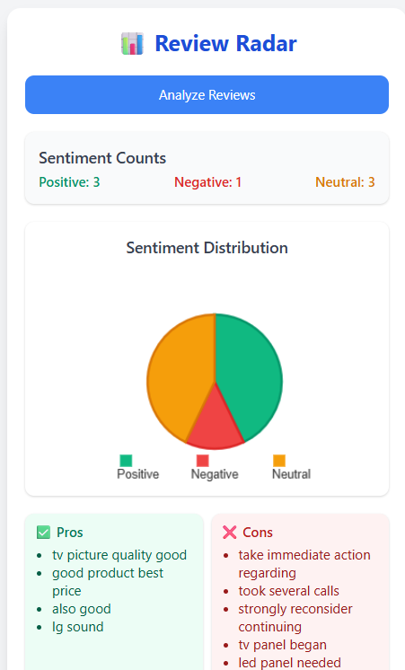

# Review Radar 📊

A Chrome extension that analyzes and visualizes customer review sentiments from popular e-commerce platforms like Amazon and Flipkart. Get instant insights into product reviews with beautiful charts and sentiment analysis.

## Features

- **Automated Review Scraping**: Extracts reviews from Amazon and Flipkart product pages
- **Sentiment Analysis**: Classifies reviews as positive, negative, or neutral
- **Visual Analytics**: Interactive pie charts and trend graphs
- **Keyword Extraction**: Identifies top pros and cons from reviews
- **Real-time Processing**: Instant analysis with loading states
- **Beautiful UI**: Modern, responsive design with Tailwind CSS

## Screenshots

### Extension Popup


### Review Analysis Results



## Installation

### Method 1: Load Unpacked Extension (Development)

1. **Download or Clone** this repository
2. **Open Chrome** and navigate to `chrome://extensions/`
3. **Enable Developer Mode** (toggle in top right)
4. **Click "Load unpacked"** and select the project folder
5. **Pin the extension** to your toolbar for easy access

### Method 2: Chrome Web Store (Coming Soon)

The extension will be available on the Chrome Web Store soon.

## Usage

1. **Navigate** to a product page on Amazon or Flipkart that has reviews
2. **Click** the Review Radar extension icon in your toolbar
3. **Click "Analyze Reviews"** to start the analysis
4. **View results** including:
   - Sentiment distribution (pie chart)
   - Positive/negative review counts
   - Key pros and cons
   - Sentiment trends over time

## Supported Platforms

- ✅ **Amazon** (.com, .in, and other domains)
- ✅ **Flipkart** (.com)
- 🔄 **More platforms** coming soon

## Technical Details

### File Structure

```
BITNBUILD-25_TECHTITANS/
├── manifest.json          # Extension configuration
├── background.js          # Service worker
├── content.js            # Content script for web scraping
└── src/
    └── popup/
        ├── popup.html    # Extension popup interface
        ├── popup.css     # Styles (Tailwind CSS)
        └── popup.js      # Popup logic and chart rendering
```

### Technologies Used

- **JavaScript ES6+**: Core functionality
- **Chrome Extension APIs**: Browser integration
- **Chart.js**: Interactive charts and graphs
- **Tailwind CSS**: Modern, responsive styling
- **HTML5/CSS3**: User interface

### Key Components

#### Content Script (`content.js`)

- Automatically detects Amazon and Flipkart pages
- Scrapes review text, ratings, and dates
- Handles dynamic content loading
- Stores data in browser storage

#### Popup Interface (`popup.js`)

- Communicates with content script
- Performs sentiment analysis
- Renders interactive charts
- Manages UI states and error handling

#### Sentiment Analysis

- Rule-based keyword matching
- Positive/negative word detection
- Rating-based classification (1-2 stars = negative, 4-5 stars = positive)
- Keyword extraction for pros/cons

## Permissions Required

- `activeTab`: Access current tab for review scraping
- `scripting`: Inject content scripts into web pages
- `storage`: Store review data locally
- `host_permissions`: Access all websites for scraping

## Development

### Prerequisites

- Chrome browser (latest version)
- Basic knowledge of JavaScript and Chrome Extensions

### Setup for Development

1. Clone the repository
2. Make changes to the code
3. Reload the extension in `chrome://extensions/`
4. Test on supported e-commerce sites

### Debugging

- Check browser console (F12) for debug messages
- Look for "Review Radar" prefixed logs
- Verify content script loading on product pages
- Check extension popup for error messages

## Troubleshooting

### "No reviews found" Error

- Ensure you're on a product page with visible reviews
- Try scrolling down to load more reviews
- Check if the site layout has changed (selectors may need updating)

### Extension Not Loading

- Verify all files are present in the project folder
- Check `manifest.json` for syntax errors
- Ensure permissions are correctly set
- Try reloading the extension

### Charts Not Displaying

- Verify Chart.js is loading properly
- Check browser console for JavaScript errors
- Ensure canvas elements exist in popup.html

## Customization

### Adding New E-commerce Sites

1. Update `content.js` with new site detection
2. Add site-specific selectors for reviews
3. Test scraping functionality
4. Update documentation

### Modifying Sentiment Analysis

1. Edit keyword lists in `popup.js`
2. Adjust rating thresholds in `classifyAndStoreReview()`
3. Add new sentiment categories if needed

## Contributing

We welcome contributions! Please follow these steps:

1. **Fork** the repository
2. **Create** a feature branch (`git checkout -b feature/AmazingFeature`)
3. **Commit** your changes (`git commit -m 'Add some AmazingFeature'`)
4. **Push** to the branch (`git push origin feature/AmazingFeature`)
5. **Open** a Pull Request

### Contribution Guidelines

- Follow existing code style and structure
- Add comments for complex logic
- Test thoroughly on supported platforms
- Update documentation as needed

## Privacy & Data

- **No data collection**: All processing happens locally
- **No external servers**: Reviews are analyzed in your browser
- **Temporary storage**: Data is stored locally and cleared periodically
- **No tracking**: No analytics or user tracking implemented

## Limitations

- Depends on e-commerce site structure (may break with UI changes)
- Limited to visible reviews on the page
- Simple keyword-based sentiment analysis
- No support for images/video reviews

## Future Enhancements

- [ ] Support for more e-commerce platforms
- [ ] Advanced NLP-based sentiment analysis
- [ ] Export functionality for analysis results
- [ ] Historical data tracking
- [ ] Comparison between different products
- [ ] Custom keyword filters

## License

This project is licensed under the MIT License - see the [LICENSE](LICENSE) file for details.

## Acknowledgments

- **Chart.js** for beautiful data visualizations
- **Tailwind CSS** for modern styling
- **Chrome Extensions API** for browser integration

## Support

For support, feature requests, or bug reports:

- Open an issue on GitHub
- Contact the development team
- Check the troubleshooting section above

## Version History

### v1.0.0 (Current)

- Initial release
- Amazon and Flipkart support
- Basic sentiment analysis
- Interactive charts and visualizations
- Modern UI with Tailwind CSS

---

**Review Radar** - Making sense of customer reviews, one analysis at a time. 📈
